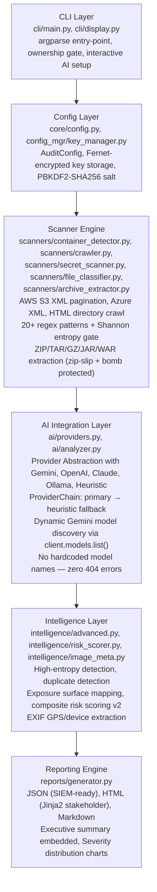
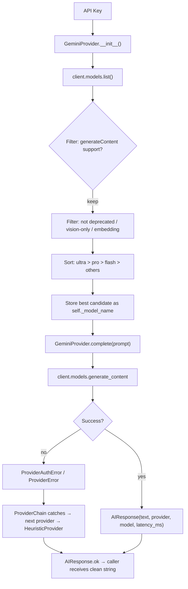
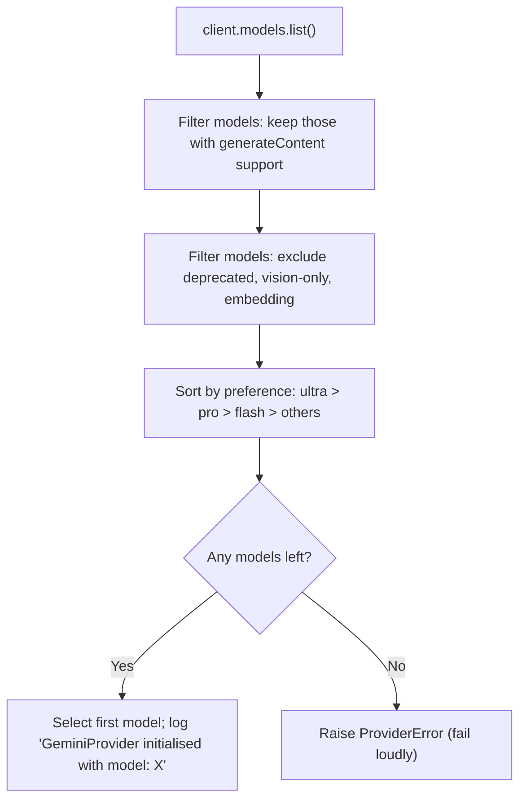
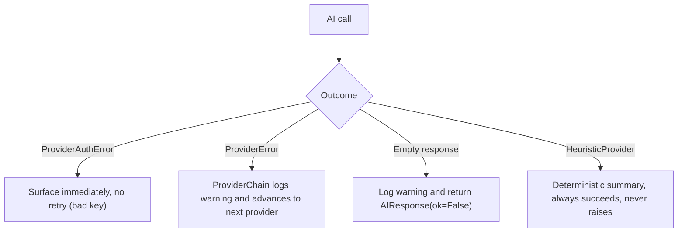
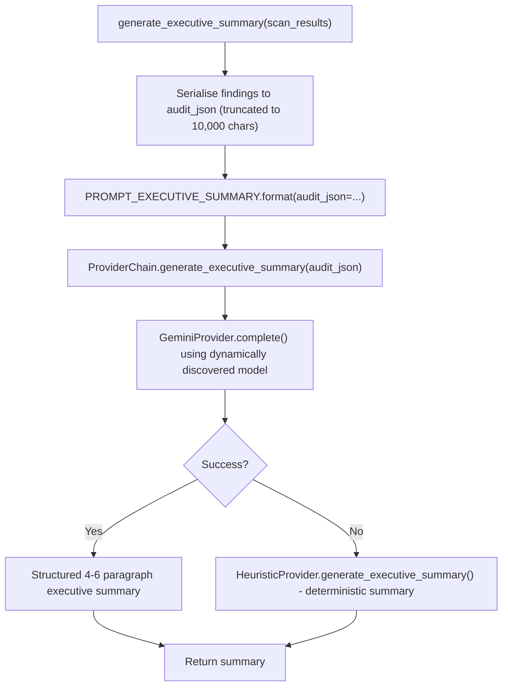
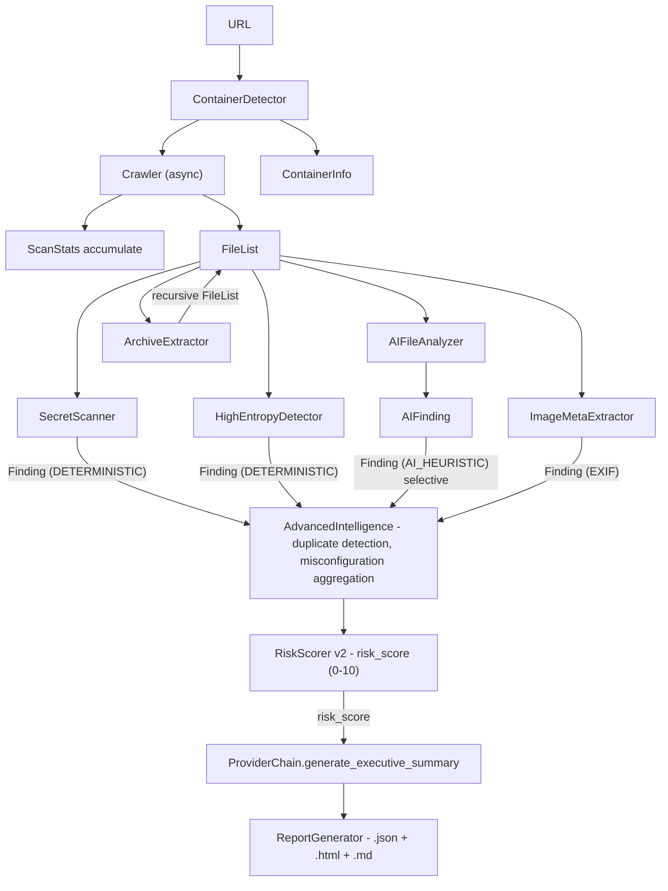

# CloudAudit

**Next-Generation AI-Powered Cloud Security Auditing Framework**

```
                                                                                              
              ,,                           ,,                                ,,    ,,         
  .g8"""bgd `7MM                         `7MM        db                    `7MM    db   mm    
.dP'     `M   MM                           MM       ;MM:                     MM         MM    
dM'       `   MM  ,pW"Wq.`7MM  `7MM   ,M""bMM      ,V^MM.  `7MM  `7MM   ,M""bMM  `7MM mmMMmm  
MM            MM 6W'   `Wb MM    MM ,AP    MM     ,M  `MM    MM    MM ,AP    MM    MM   MM    
MM.           MM 8M     M8 MM    MM 8MI    MM     AbmmmqMA   MM    MM 8MI    MM    MM   MM    
`Mb.     ,'   MM YA.   ,A9 MM    MM `Mb    MM    A'     VML  MM    MM `Mb    MM    MM   MM    
  `"bmmmd'  .JMML.`Ybmd9'  `Mbod"YML.`Wbmd"MML..AMA.   .AMMA.`Mbod"YML.`Wbmd"MML..JMML. `Mbmo 
       
```

[](#)
[](#)
[](#)
[](#)
[](#)
[](#)
[](#)
[](#)
[](#)
[](#)

<p align="center">

<a href="https://discord.gg/QtN6fEeSkP">
  
</a>

</p>

> **Developed by xtawb** | [https://linktr.ee/xtawb](https://linktr.ee/xtawb) | [GitHub](https://github.com/xtawb/cloudaudit)

---

## Overview

CloudAudit is an enterprise-grade cloud storage security posture auditing framework. It automatically discovers, crawls, and analyses publicly exposed cloud storage containers — AWS S3, Google Cloud Storage, Azure Blob Storage, open directory listings — to identify secret leakage, credential exposure, compliance gaps, and misconfigurations before attackers do.

CloudAudit is designed for **defensive internal use only**. Every design decision prioritises safety:

- **Read-only by architecture**: The HTTP client exposes only `GET`, `HEAD`, and `OPTIONS`. `PUT` and `DELETE` do not exist.
- **Ownership-gated**: The engine refuses to start without explicit `--confirm-ownership` and `--org-name` flags.
- **Secrets never stored raw**: All pattern matches are redacted before being written to findings or transmitted to AI providers.
- **No exploitation guidance**: AI providers are explicitly prompted to produce only defensive remediation recommendations.

---

## Technical Architecture

### Layered Architecture



```
┌─────────────────────────────────────────────────────────────────────┐
│                          CLI Layer                                  │
│   cli/main.py  ·  cli/display.py                                    │
│   argparse entry-point · ownership gate · interactive AI setup      │
└───────────────────────────────┬─────────────────────────────────────┘
                                │
┌───────────────────────────────▼─────────────────────────────────────┐
│                        Config Layer                                 │
│   core/config.py  ·  config_mgr/key_manager.py                      │
│   AuditConfig · Fernet-encrypted key storage · PBKDF2-SHA256 salt   │
└───────────────────────────────┬─────────────────────────────────────┘
                                │
┌───────────────────────────────▼─────────────────────────────────────┐
│                       Scanner Engine                                │
│   scanners/container_detector.py  ·  scanners/crawler.py            │
│   scanners/secret_scanner.py  ·  scanners/file_classifier.py        │
│   scanners/archive_extractor.py                                     │
│   ─────────────────────────────────────────────────────────────     │
│   AWS S3 XML pagination · Azure XML · HTML directory crawl          │
│   20+ regex patterns + Shannon entropy gate                         │
│   ZIP/TAR/GZ/JAR/WAR extraction (zip-slip + bomb protected)         │
└───────────────────────────────┬─────────────────────────────────────┘
                                │
┌───────────────────────────────▼─────────────────────────────────────┐
│                     AI Integration Layer                            │
│   ai/providers.py  ·  ai/analyzer.py                                │
│   ─────────────────────────────────────────────────────────────     │
│   Provider Abstraction  ──►  GeminiProvider (google.genai SDK)      │
│                          ──►  OpenAICompatibleProvider (GPT-4o)     │
│                          ──►  ClaudeProvider (Anthropic)            │
│                          ──►  OllamaProvider (local)                │
│                          ──►  HeuristicProvider (always available)  │
│   ─────────────────────────────────────────────────────────────     │
│   ProviderChain: primary → heuristic fallback                       │
│   Dynamic Gemini model discovery via client.models.list()           │
│   No hardcoded model names — zero 404 errors                        │
└───────────────────────────────┬─────────────────────────────────────┘
                                │
┌───────────────────────────────▼─────────────────────────────────────┐
│                    Intelligence Layer                               │
│   intelligence/advanced.py  ·  intelligence/risk_scorer.py          │
│   intelligence/image_meta.py                                        │
│   ─────────────────────────────────────────────────────────────     │
│   High-entropy detection · Duplicate/reuse detection                │
│   Exposure surface mapping · Composite risk scoring v2              │
│   EXIF GPS/device extraction                                        │
└───────────────────────────────┬─────────────────────────────────────┘
                                │
┌───────────────────────────────▼─────────────────────────────────────┐
│                     Reporting Engine                                │
│   reports/generator.py                                              │
│   ─────────────────────────────────────────────────────────────     │
│   JSON (SIEM-ready) · HTML (Jinja2 stakeholder) · Markdown          │
│   Executive summary embedded · Severity distribution charts         │
└─────────────────────────────────────────────────────────────────────┘
```

### AI Integration Layer — Detail



```
API Key
  │
  ▼
GeminiProvider.__init__()
  │
  ├─► client.models.list()           ← dynamic discovery, no hardcoded names
  │         │
  │         ▼
  │   Filter: generateContent support
  │   Filter: not deprecated / vision-only / embedding
  │   Sort:   ultra > pro > flash > others
  │         │
  │         ▼
  │   self._model_name = best_candidate   ← stored once, reused forever
  │
  ▼
GeminiProvider.complete(prompt)
  │
  ├─► client.models.generate_content(model=self._model_name, ...)
  │         │
  │         ├─ success → AIResponse(text, provider, model, latency_ms)
  │         │
  │         └─ failure → ProviderAuthError (401/403) or ProviderError
  │                           │
  │                           ▼
  │                    ProviderChain catches → next provider → HeuristicProvider
  │
  ▼
AIResponse.ok  →  caller receives clean string, never crashes
```

### Model Selection Flow



```
client.models.list()
        │
        ▼
  for model in all_models:
    │
    ├─ supported_generation_methods includes "generateContent"? → keep
    ├─ name contains "vision"/"embedding"/"deprecated"?         → skip
    └─ neither?                                                 → keep
        │
        ▼
  Sort candidates by preference: ultra > pro > flash > others
        │
        ▼
  Select candidates[0]  ──►  log "GeminiProvider initialised with model: X"
        │
        ▼
  No candidates → raise ProviderError (fail loudly, never silently)
```

### Error Handling Flow



```
AI call
  │
  ├─ ProviderAuthError  → surface immediately, no retry (bad key)
  │
  ├─ ProviderError      → ProviderChain logs warning, advances to next provider
  │
  ├─ Empty response     → log warning, return AIResponse(ok=False)
  │
  └─ HeuristicProvider  → deterministic summary, always succeeds, never raises
```

### Executive Summary Pipeline



```
generate_executive_summary(scan_results)
        │
        ▼
  Serialise findings → audit_json (truncated to 10,000 chars)
        │
        ▼
  PROMPT_EXECUTIVE_SUMMARY.format(audit_json=...)
        │
        ▼
  ProviderChain.generate_executive_summary(audit_json)
        │
        ├─ GeminiProvider.complete()  → uses dynamically discovered model
        │         └─ success → structured 4-6 paragraph executive summary
        │
        └─ HeuristicProvider.generate_executive_summary()  ← fallback
                  └─ always succeeds, severity-aware deterministic summary
```

### Data Flow Between Components



```
URL
 │
 ▼
ContainerDetector  ──────────────────────────────┐
 │                                               │ ContainerInfo
 ▼                                               ▼
Crawler (async)                            ScanStats accumulate
 │  ──► FileList
 │
 ├──► SecretScanner         → Finding(DETERMINISTIC)
 ├──► HighEntropyDetector   → Finding(DETERMINISTIC)
 ├──► AIFileAnalyzer        → AIFinding → Finding(AI_HEURISTIC) [selective]
 ├──► ArchiveExtractor      → recursive FileList
 └──► ImageMetaExtractor    → Finding(EXIF)
         │
         ▼
    AdvancedIntelligence (duplicate detection, misconfiguration aggregation)
         │
         ▼
    RiskScorer v2  →  risk_score (0-10)
         │
         ▼
    ProviderChain.generate_executive_summary()
         │
         ▼
    ReportGenerator  →  .json  +  .html  +  .md
```

### Dependency Graph

```mermaid
graph TD
    cloudaudit["cloudaudit"]
    aiohttp["aiohttp — async HTTP"]
    aiofiles["aiofiles — async file I/O"]
    pythonmagic["python-magic — MIME type detection"]
    Pillow["Pillow — EXIF metadata extraction"]
    cryptography["cryptography — Fernet key encryption"]
    pyyaml["pyyaml — YAML config parsing"]
    rich["rich — terminal progress UI"]
    jinja2["jinja2 — HTML report templating"]
    google_genai["google-genai (optional) — Gemini provider"]
    openai["openai (optional) — OpenAI / DeepSeek / custom endpoint"]
    anthropic["anthropic (optional) — Claude provider"]
    py7zr["py7zr (optional) — 7-Zip archive extraction"]

    cloudaudit --> aiohttp
    cloudaudit --> aiofiles
    cloudaudit --> pythonmagic
    cloudaudit --> Pillow
    cloudaudit --> cryptography
    cloudaudit --> pyyaml
    cloudaudit --> rich
    cloudaudit --> jinja2
    cloudaudit --> google_genai
    cloudaudit --> openai
    cloudaudit --> anthropic
    cloudaudit --> py7zr
```



```
cloudaudit
├── aiohttp          — async HTTP (GET/HEAD/OPTIONS only)
├── aiofiles         — async file I/O for archive workspace
├── python-magic     — MIME type detection
├── Pillow           — EXIF metadata extraction
├── cryptography     — Fernet key encryption (Fernet + PBKDF2)
├── pyyaml           — YAML config parsing
├── rich             — terminal progress UI
├── jinja2           — HTML report templating
│
├── [optional] google-genai    — Gemini provider (modern SDK)
├── [optional] openai          — OpenAI / DeepSeek / custom endpoint
├── [optional] anthropic       — Claude provider
└── [optional] py7zr           — 7-Zip archive extraction
```

---

## Architecture (File Tree)

```
cloudaudit/
├── cli/
│   ├── main.py              CLI entry point — argparse, ownership gate, interactive AI setup
│   └── display.py           Professional real-time phase-based terminal output (no emojis)
├── core/
│   ├── config.py            AuditConfig — ownership gate enforcement
│   ├── constants.py         Version, branding, provider model fallbacks, compliance maps
│   ├── engine.py            11-phase async audit orchestrator
│   ├── exceptions.py        Exception hierarchy
│   ├── logger.py            Structured logging configuration
│   └── models.py            Finding, ExposedFile, ContainerInfo, ScanStats data models
├── ai/
│   ├── providers.py         Unified AI layer — Gemini (google.genai), OpenAI, Claude,
│   │                        DeepSeek, Ollama, custom endpoints, heuristic fallback,
│   │                        automatic provider chain, dynamic model discovery
│   └── analyzer.py          AI semantic file analysis + ML-inspired anomaly scoring
├── config_mgr/
│   ├── key_manager.py       Encrypted API key storage (Fernet AES), live key validation
│   └── updater.py           GitHub release check + safe pip-based auto-update
├── intelligence/
│   ├── advanced.py          High-entropy detection, duplicate/reuse detection,
│   │                        exposure surface mapping, misconfiguration pattern analysis
│   ├── image_meta.py        EXIF GPS coordinates, device info, author metadata
│   └── risk_scorer.py       Weighted composite risk scoring v2 (0-10 scale)
├── reports/
│   └── generator.py         JSON + HTML + Markdown reports with full branding
├── scanners/
│   ├── archive_extractor.py ZIP/TAR/GZ/JAR/WAR extraction — zip-slip + bomb protected
│   ├── container_detector.py Auto-detect S3/GCS/Azure/Open Directory
│   ├── crawler.py            S3 XML pagination, Azure XML, HTML recursive crawl
│   ├── file_classifier.py    70+ extension/name mappings to FileType
│   └── secret_scanner.py     20+ secret patterns with entropy scoring and validation
└── utils/
    ├── helpers.py            Shannon entropy, redaction, formatting utilities
    └── http_client.py        Read-only async HTTP client (GET/HEAD/OPTIONS only)
```

### 11-Phase Detection Pipeline

```
URL Input
    |
    v
[Phase 1]  Container Detection
           XML namespace parsing, HTTP header fingerprinting, hostname patterns
           -> AWS S3 / Google Cloud Storage / Azure Blob / Open Directory
    |
    v
[Phase 2]  Recursive File Crawl
           S3: XML IsTruncated pagination + ContinuationToken
           Azure: EnumerationResults XML + NextMarker
           HTML: Apache/nginx directory listing recursion
    |
    v
[Phase 3]  Misconfiguration Analysis
           Public access detection, sensitive filename detection
           -> CIS/NIST/SOC2/PCI-DSS/ISO27001 compliance mapping
    |
    v
[Phase 4]  Concurrent Content Analysis (async, bounded semaphore)
           |-- Deterministic secret scanning (20+ regex + entropy gate)
           |-- High-entropy string detection (FP-filtered)
           |-- AI semantic analysis (high-value files only)
           +-- Image EXIF metadata extraction (GPS, device, author)
    |
    v
[Phase 5]  Archive Extraction (optional --extract-archives)
           Zip-slip protected, decompression bomb guarded
           Supports: .zip .tar .tar.gz .tar.bz2 .tar.xz .7z .jar .war
           Nested archive recursion supported
    |
    v
[Phase 6]  Image EXIF Analysis (optional --deep-metadata)
           GPS coordinates, device manufacturer/model, author fields
    |
    v
[Phase 7]  Duplicate & Reuse Detection
           SHA-256 hash-based exact duplicate detection across files
           Credential reuse pattern identification (3+ files threshold)
    |
    v
[Phase 8]  Cloud Misconfiguration Aggregation
    |
    v
[Phase 9]  Risk Scoring v2
           Weighted severity x category multipliers x exposure surface
    |
    v
[Phase 10] AI Executive Summary
           Automatic provider chain: primary -> heuristic fallback
           Gemini: dynamic model discovery, zero 404 errors
    |
    v
[Phase 11] Report Output
           JSON (SIEM-ready) + HTML (stakeholder) + Markdown (Confluence/Jira)
```

---

## Installation

### Requirements

- Python 3.11+
- pip

```bash
git clone https://github.com/xtawb/cloudaudit
cd cloudaudit
pip install -r requirements.txt
pip install -e .
```

### Optional Dependencies

```bash
pip install google-genai       # Google Gemini AI (modern SDK)
pip install openai             # OpenAI GPT / DeepSeek (OpenAI-compatible)
pip install anthropic          # Anthropic Claude
pip install Pillow             # Image EXIF metadata analysis
pip install cryptography       # Encrypted local API key storage
pip install py7zr              # 7-Zip archive extraction
```

---

## Configuration

### Secure API Key Management

```bash
# Store encrypted API key interactively
cloudaudit config --set-api gemini

# List all configured providers
cloudaudit config --list-providers

# Remove a stored key
cloudaudit config --remove-api openai
```

Keys are stored encrypted at `~/.cloudaudit/config.enc` using Fernet (AES-128-CBC + HMAC-SHA256).
The encryption key is derived via PBKDF2-SHA256 with 100,000 iterations from a per-installation random salt.

Alternatively, set environment variables:

| Provider  | Environment Variable    |
|-----------|------------------------|
| Gemini    | `GEMINI_API_KEY`        |
| OpenAI    | `OPENAI_API_KEY`        |
| Claude    | `ANTHROPIC_API_KEY`     |
| DeepSeek  | `DEEPSEEK_API_KEY`      |

---

## Usage

### Minimal Scan

```bash
cloudaudit -u https://mybucket.s3.amazonaws.com/ \
           --confirm-ownership \
           --org-name "Acme Corp"
```

### Full Audit with AI and Archives

```bash
cloudaudit -u https://mybucket.s3.amazonaws.com/ \
           --confirm-ownership \
           --org-name "Acme Corp" \
           --extract-archives \
           --deep-metadata \
           --provider gemini \
           -o reports/acme_q1_2025 \
           --format all \
           --verbose
```

### Google Cloud Storage

```bash
cloudaudit -u https://storage.googleapis.com/my-bucket/ \
           --confirm-ownership --org-name "Acme Corp" -o reports/gcs
```

### Azure Blob Storage

```bash
cloudaudit -u https://myaccount.blob.core.windows.net/mycontainer/ \
           --confirm-ownership --org-name "Acme Corp" -o reports/azure
```

### Local Ollama (No API Key Required)

```bash
cloudaudit -u https://mybucket.s3.amazonaws.com/ \
           --confirm-ownership --org-name "Acme Corp" \
           --provider ollama --ollama-model llama3 \
           -o reports/local_audit
```

### DeepSeek AI

```bash
cloudaudit -u https://mybucket.s3.amazonaws.com/ \
           --confirm-ownership --org-name "Acme Corp" \
           --provider deepseek --api-key sk-... \
           -o reports/audit
```

### Custom OpenAI-Compatible Endpoint

```bash
cloudaudit -u https://mybucket.s3.amazonaws.com/ \
           --confirm-ownership --org-name "Acme Corp" \
           --provider custom \
           --provider-url https://my-llm.internal/v1 \
           --api-key mykey \
           -o reports/audit
```

---

## CLI Reference

### Required Flags

| Flag | Description |
|------|-------------|
| `-u`, `--url URL` | Target cloud storage URL |
| `--confirm-ownership` | Declare authorisation to audit this resource |
| `--org-name ORG` | Organisation name for the report |

### Scan Control

| Flag | Default | Description |
|------|---------|-------------|
| `--max-depth N` | 15 | Maximum recursive crawl depth |
| `--max-size BYTES` | 20971520 | Maximum per-file download size |
| `--extensions LIST` | (all text types) | Comma-separated extension allowlist |
| `--ignore-paths LIST` | | Path fragments to skip |
| `--min-severity` | `LOW` | Minimum finding severity |
| `--extract-archives` | off | Extract and scan archives |
| `--deep-metadata` | off | Extract EXIF from images |

### AI Provider

| Flag | Default | Description |
|------|---------|-------------|
| `--provider NAME` | | `gemini`, `openai`, `claude`, `deepseek`, `ollama`, `custom` |
| `--api-key KEY` | | API key |
| `--provider-url URL` | | Base URL for custom endpoints |
| `--ollama-url URL` | `http://localhost:11434` | Ollama server |
| `--ollama-model MODEL` | `llama3` | Ollama model name |

### Output

| Flag | Default | Description |
|------|---------|-------------|
| `-o`, `--output BASE` | | Output base filename |
| `--format FORMAT` | `all` | `json` / `html` / `markdown` / `all` |
| `-v`, `--verbose` | off | Verbose output including AI summary |
| `-d`, `--debug` | off | Full debug with stack traces |
| `-q`, `--quiet` | off | Suppress all terminal output |
| `--no-update-check` | off | Skip GitHub update check |

---

## Detection Engine

### Deterministic Patterns

| Rule | Provider | Severity | Compliance |
|------|----------|----------|------------|
| `AWS_ACCESS_KEY` | AWS | Critical | CIS 2.1.5, NIST IA-5 |
| `AWS_SECRET_KEY` | AWS | Critical | CIS 2.1.5, NIST IA-5 |
| `GCP_SERVICE_ACCOUNT_KEY` | GCP | Critical | CIS 2.1.5, NIST IA-5 |
| `AZURE_STORAGE_KEY` | Azure | Critical | CIS 2.1.5, NIST IA-5 |
| `PRIVATE_KEY` | Generic | Critical | NIST IA-5, SOC2 CC6.7 |
| `DATABASE_URL` | Generic | Critical | NIST IA-5, PCI-DSS Req 3 |
| `GITHUB_PAT` | GitHub | Critical | CIS 2.1.5, NIST IA-5 |
| `CREDIT_CARD` | PII | Critical | PCI-DSS Req 3 |
| `HARDCODED_PASSWORD` | Generic | High | NIST IA-5, SOC2 CC6.7 |
| `JWT_TOKEN` | Generic | Medium | SOC2 CC6.7 |
| `EMAIL_ADDRESS` | PII | Low | SOC2 CC6.7 |
| `INTERNAL_IP` | Infrastructure | Low | NIST SC-7 |

### High-Entropy String Detection

Uses Shannon entropy analysis to catch secrets not matching known formats:

- Sliding-window token analysis, minimum 16 characters
- Default entropy threshold: 4.5 bits/character (configurable with `--min-entropy`)
- False-positive filter: MD5/SHA1/SHA256 hashes, UUIDs, pure numeric, ISO dates, URLs
- Character class gate: requires at least 2 of {uppercase, lowercase, digit, special}

### AI Semantic Analysis

AI analysis triggers selectively for high-value files (`.env`, `config.*`, `credentials`, `.pem`, `settings.py`, `application.yml`, `terraform.tfstate`, `.aws/`, `.ssh/`, etc.). Content is sanitised before transmission:

- Base64 strings >=40 chars are truncated to first 8 chars
- PEM blocks are replaced with `[REDACTED]`
- AI findings are labelled `[AI]` with a maximum 95% confidence cap

---

## Risk Scoring v2

```
raw  = sum(severity_weight × category_multiplier for each finding)
score = 10 × (1 - exp(-raw / 8))          # soft exponential cap at 10
```

| Severity | Weight | Category | Multiplier |
|----------|--------|----------|-----------|
| Critical | 4.0 | Secret Exposure | 1.5x |
| High | 2.0 | Credential File | 1.4x |
| Medium | 0.8 | PII Exposure | 1.2x |
| Low | 0.2 | Public Access | 0.9x |

Override: Any cloud credential finding (AWS, GCP, Azure, GitHub) forces minimum score of 8.5.

---

## Compliance Mapping

| Framework | Covered Controls |
|-----------|-----------------|
| CIS Benchmarks | 2.1, 2.2, 2.3, 2.4, 2.1.5 |
| NIST 800-53 | SC-7, IA-5, AU-12 |
| SOC 2 | CC6.1, CC6.7, CC7.2 |
| PCI-DSS | Req 1.3, Req 3 |
| ISO 27001 | A.9.4, A.10.1 |

---

## Security Design

| Operation | Status |
|-----------|--------|
| HTTP PUT / DELETE | Not implemented — methods do not exist in HTTPClient |
| Exploitation guidance | Blocked at AI prompt level |
| Raw secret storage | Never — redacted before any write operation |
| External telemetry | None |
| API key logging | Never |

---

## Auto-Update System

CloudAudit checks [GitHub releases](https://github.com/xtawb/cloudaudit/releases/latest) at startup:

```
A new version is available (v1.0.2).
Do you want to update now? [Y/n]:
```

- Network failures are silent and non-fatal
- On decline: continues execution with current version
- On accept: pip upgrade from GitHub, confirms success
- On update failure: reports error, continues running

---

## Changelog

See [CHANGELOG.md](CHANGELOG.md) for full version history.

---

## Roadmap

- AWS SDK bucket policy and ACL inspection
- SARIF output format for GitHub Advanced Security
- Jira/ServiceNow automatic ticket creation
- Multi-bucket batch scanning mode
- Docker image layer scanning

---

## Legal Notice

CloudAudit is intended for use **only** on cloud storage resources you own or have explicit written authorisation to audit. Unauthorised scanning is illegal under the CFAA (US), Computer Misuse Act (UK), and equivalent laws worldwide.

By using `--confirm-ownership`, you declare that you are authorised to audit the target resource and accept full legal responsibility for your use of this tool.


---

## Author

**Developed by xtawb**
- [https://linktr.ee/xtawb](https://linktr.ee/xtawb)
- [https://github.com/xtawb/cloudaudit](https://github.com/xtawb/cloudaudit)
- [https://cloudaudit.readthedocs.io/en/latest](https://cloudaudit.readthedocs.io/en/latest)

---

*CloudAudit v1.0.2 — Next-Generation AI-Powered Cloud Security Auditing Framework*  
*Powered by xtawb | Defensive. Intelligent. Enterprise-Grade.*
